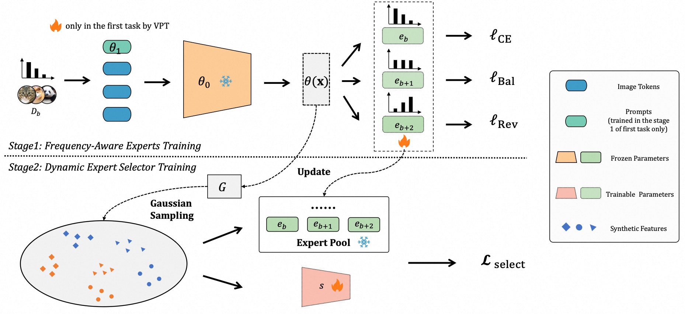

# Addressing Imbalanced Domain-Incremental Learning through Dual-Balance Collaborative Experts


<div align="center">
    <div>
        <a href='http://www.lamda.nju.edu.cn/lil' target='_blank'>Lan Li</a>&emsp;
        <a href='http://www.lamda.nju.edu.cn/zhoudw' target='_blank'>Da-Wei Zhou</a>&emsp;
        <a href='http://www.lamda.nju.edu.cn/yehj' target='_blank'>Han-Jia Ye</a>&emsp;
        <a href='http://www.lamda.nju.edu.cn/zhandc' target='_blank'>De-Chuan Zhan</a>&emsp;
    </div>
    <div>
    State Key Laboratory for Novel Software Technology, Nanjing University
    </div>
</div>

<div align="center">

  <a href="https://arxiv.org/abs/2507.07100">
    
  </a>

</div>

The code repository for "[Addressing Imbalanced Domain-Incremental Learning through Dual-Balance Collaborative Experts](https://arxiv.org/abs/2507.07100)"  in PyTorch.  If you use any content of this repo for your work, please cite the following bib entry: 

```bibtex
@article{li2025addressing,
  title={Addressing Imbalanced Domain-Incremental Learning through Dual-Balance Collaborative Experts},
  author={Lan Li and Da-Wei Zhou and Han-Jia Ye and De-Chuan Zhan},
  journal={ICML},
  year={2025}
}
```


# 📢 **Updates**

[07/2025] Code has been released.

[07/2025] [arXiv](https://arxiv.org/abs/2507.07100) paper has been released.


# 📝 Introduction
Domain-Incremental Learning (DIL) focuses on continual learning in non-stationary environments, requiring models to adjust to evolving domains while preserving historical knowledge. DIL faces two critical challenges in the context of imbalanced data: intra-domain class imbalance and cross-domain class distribution shifts.  These challenges significantly hinder model performance, as intra-domain imbalance leads to underfitting of few-shot classes, while cross-domain shifts require maintaining well-learned many-shot classes and transferring knowledge to improve few-shot class performance in old domains. To overcome these challenges, we introduce the Dual-Balance Collaborative Experts (DCE) framework. DCE employs a frequency-aware expert group, where each expert is guided by specialized loss functions to learn features for specific frequency groups, effectively addressing intra-domain class imbalance. Subsequently, a dynamic expert selector is learned by synthesizing pseudo-features through balanced Gaussian sampling from historical class statistics. This mechanism navigates the trade-off between preserving many-shot knowledge of previous domains and leveraging new data to improve few-shot class performance in earlier tasks. Extensive experimental results on four benchmark datasets demonstrate DCE’s state-of-the-art performance. 

<div align="center">

</div>

## 🔧 Requirements

**Environment**

You can create a conda environment and run the following command to install the dependencies.
```
conda install --file requirements.txt
```

**Dataset**

There are **4** datasets involved in the paper, CDDB, CORe50, DomainNet and Office-Home respectively. Follow the two-step guideline to prepare them for the reproduction.

1. Download the datasets mannually according the recommended.
    - **CDDB**: You can access the dataset at this [link](https://coral79.github.io/CDDB_web/).
    - **CORe50**: You can access the dataset at this [link](https://vlomonaco.github.io/core50/index.html#dataset). Please download the `core50_imgs.npz` file.
    - **DomainNet**: You can access the dataset at this [link](http://ai.bu.edu/M3SDA/). Please download the `cleaned version` file.
    - **Office-Home**: You can access the dataset at this [link](https://hemanthdv.github.io/officehome-dataset/).
2. Check if the dataset has been downloaded properly. The dataset directory is expected to have the following structure:
    ```
    CDDB
    ├── biggan
    ├── crn 
    ├── ...
    ├── wild
    
    CORe50
    ├── s1
    ├── ...
    ├── s11
    ├── labels.pkl
    ├── LUP.pkl
    ├── paths.pkl
    
    DomainNet
    ├── clipart
    ├── ...
    ├── sketch
    ├── clipart_test.txt
    ├── clipart_train.txt
    ├── ...

    OfficeHome
    ├── Art
    ├── Clipart
    ├── Product
    ├── Real_World

    ```

3. Specify the dataset path in the config file under the `configs` directory.
    ```
    "data_path": "$Your/Dataset/Path/Here$"
    ```

## 💡 Running scripts

To prepare your JSON files, refer to the settings in the `Configs` folder and run the following command. All main experiments from the paper are already provided in the `exps` folder, you can simply execute them to reproduce the results found in the `logs` folder.

```
python main.py --config configs/officehome.json --order 1
```

## 🎈 Acknowledgement

This repo is based on [CIL_Survey](https://github.com/zhoudw-zdw/CIL_Survey) and [PyCIL](https://github.com/G-U-N/PyCIL). 

## 💭 Correspondence

If you have any questions, please  contact me via [email](mailto:lil@lamda.nju.edu.cn) or open an [issue](https://github.com/Lain810/DCE/issues/new).

